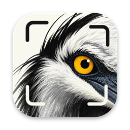
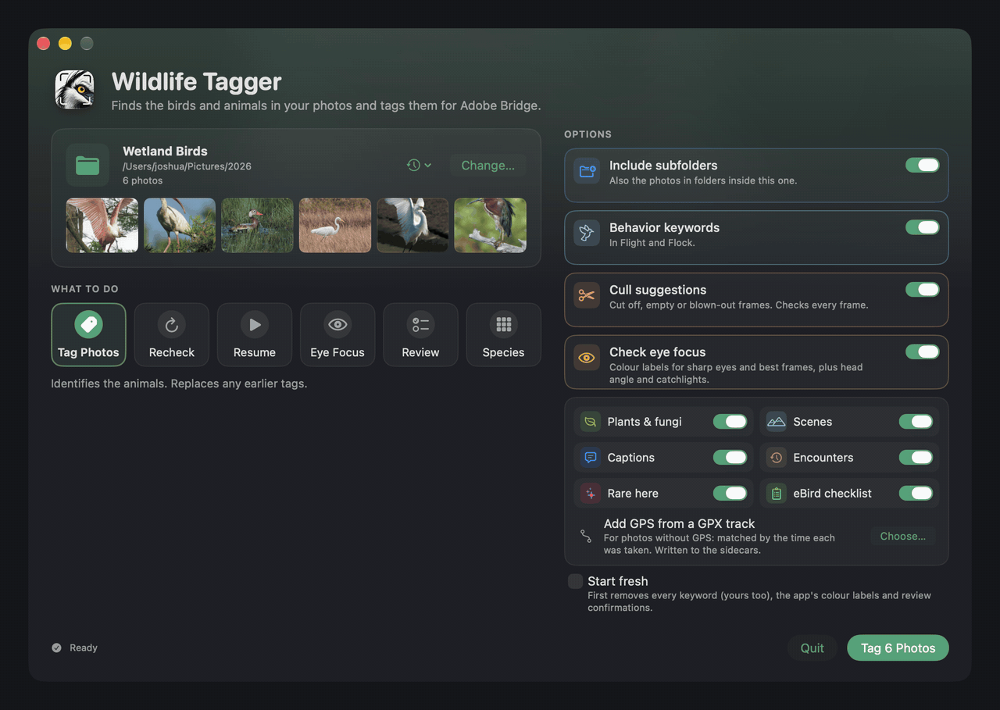
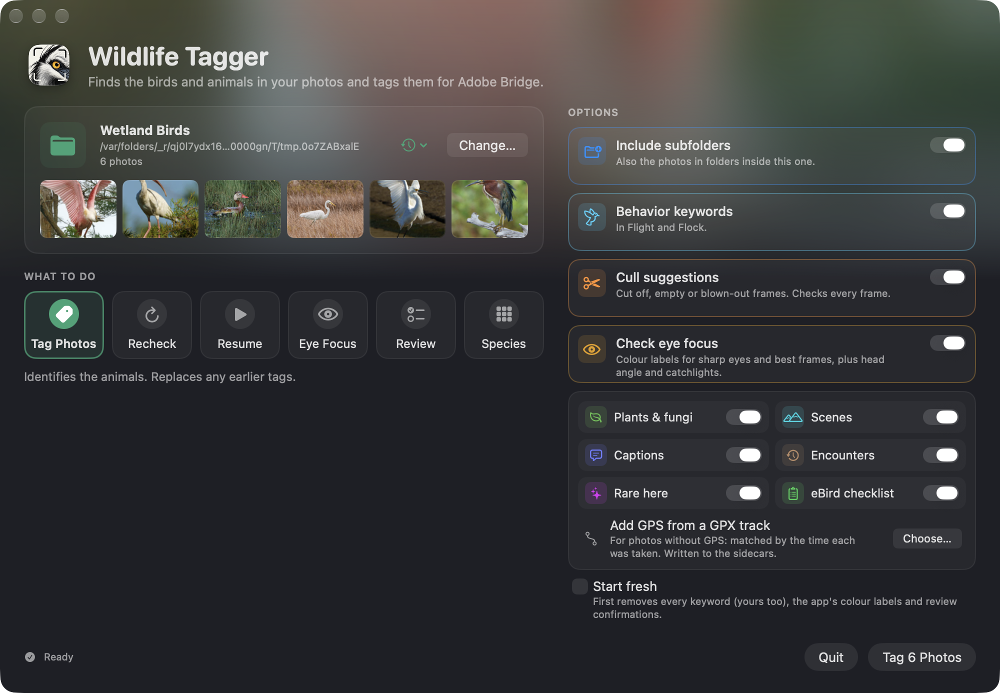
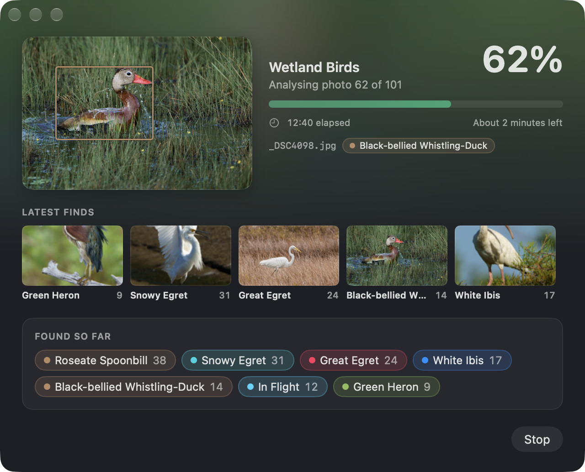
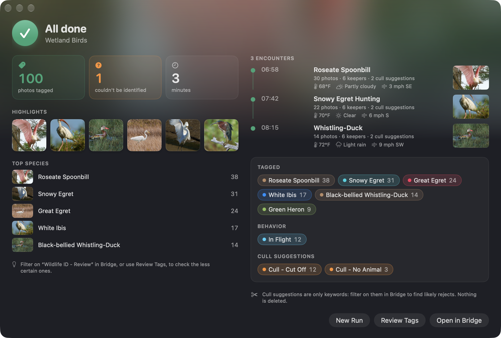

<div align="center">



# Wildlife Tagger

**Cull less. Shoot more. Let your Mac name every bird, beast and bloom in your photos.**

Wildlife Tagger identifies the wildlife in your RAW files and writes the species, behaviour,
focus checks and a ready-to-use caption straight into **Adobe Bridge**, **Lightroom** and **Capture One**.
Built by a wildlife photographer, for wildlife photographers.

[](https://github.com/zjysrfjwv2-prog/wildlife-tagger-releases/releases/latest)


<br>



</div>

<br>

## Thousands of frames in. Organised keywords out.

You come home from a week in the field with 4,000 frames: egrets and herons, a deer at the tree line, ducks in
flight, a gator on a log, dragonflies, wildflowers, a sunset or two. Wildlife Tagger reads every one, tells you what's in it,
which frame of each burst is the keeper, and where the trip's best moments happened, so you can
find them in Bridge in seconds instead of scrolling for an evening.

| | |
|---|---|
| 🐦 **Names the species** | Birds, mammals, reptiles, insects, plants and fungi, from RAW, DNG, JPEG, HEIC, TIFF and PNG. Tuned for the birds of the US and Canada. |
| 📍 **Knows where you were** | Every ID is checked against real sightings near the photo's GPS position, so a bird that has never been recorded there gets corrected to one that has. |
| 👁️ **Finds the sharp eye** | Marks the sharpest frame of each burst, flags soft eyes, and adds *Head Toward Camera* and *Catchlight* for the keepers. |
| ✂️ **Suggests culls** | Cut-off wings, empty frames and blown highlights get a keyword you can filter on. Nothing is ever deleted. |
| 🕊️ **Understands behaviour** | *In Flight* and *Flock* keywords, and encounters that group a burst of the same animal into a story with the weather at the time. |
| 📝 **Writes captions** | *"Wood Stork and White Ibis at sunrise · Waller County, Texas · September 12, 2026"* in the Description field, ready for upload. |
| 🌿 **Sees the scenery too** | Flowers, mushrooms, mountains, seascapes, wetlands, sunrises and sunsets are tagged as well. |
| 🧾 **eBird, GPS and rarities** | Export an eBird checklist, geotag photos from your phone's GPX track, and spot *Rare Here* species. |

<br>

## Choose a folder. Press one button.

<div align="center">

</div>

Drop in a folder of photos, pick what you want (names, focus checks, culls, captions, encounters and more), and press **Tag Photos**.
Every option is visible at once, and your choices are remembered for next time.

<br>

## Watch it work

<div align="center">

</div>

A live view shows the photo being analysed and each new species as it turns up, so you can spot a wrong ID
while the run is still going. Models load in the background when the app opens, so tagging starts straight away.

<br>

## See what you got

<div align="center">

</div>

The results screen gives you your best frames, the species you found, and a timeline of the morning:
when each animal appeared, how many keepers you got, and what the weather was doing.
Then **Review Tags** lets you confirm or correct anything in one click, and **Open in Bridge** takes you
straight to the keywords.

<br>

## What lands in Bridge

```
Egret                          Snowy Egret
In Flight                      Best in Burst · Top 3 in Burst
Head Toward Camera             Catchlight
Scenes | Wetland               Plants | Pansy
Places | United States | Texas | Waller County
Encounters | 2026-09-12 | 06:54 Great Egret
Description: Great Egret at sunrise · Waller County, Texas · September 12, 2026
```

RAW files get a standard `.xmp` sidecar next to them. JPEG, HEIC, TIFF, PNG and DNG files get the keywords
inside the file. **Your picture data is never changed.**

<br>

## Your photos stay on your Mac

Everything runs locally on your computer. Photos are never uploaded. Only two optional lookups use the internet,
and they send species names and an approximate position, never an image: the location check (GBIF) and the weather
for encounters (Open-Meteo). You can turn the location check off.

<br>

## Get it

**You need:** a Mac with Apple silicon (M1 or later), macOS 14 Sonoma or newer, and about 10 GB of free space.

1. **[Download the latest version](https://github.com/zjysrfjwv2-prog/wildlife-tagger-releases/releases/latest)** (`Wildlife.Tagger.zip`) and unzip it.
2. Drag **Wildlife Tagger** into your **Applications** folder and open it.
3. macOS will say it can't verify the app, because it isn't from the App Store. Click **Done**, then open
   **System Settings › Privacy & Security**, scroll down and click **Open Anyway**. You only do this once.
4. The first run downloads the AI models (about 5.5 GB, a few minutes). After that it starts instantly.

**Updates arrive inside the app.** Choose **Wildlife Tagger › Check for Updates…**, or leave automatic checks on
and it will tell you when there's something new.

<br>

## Questions

<details>
<summary><b>Does it change my photos?</b></summary>
Never. RAW files stay untouched and get a sidecar file. Other formats get keywords written alongside the picture data,
which is left as it was.
</details>

<details>
<summary><b>Will it overwrite my own keywords?</b></summary>
Re-running a folder replaces the keywords the app wrote, but photos you confirmed in the review window are left alone, and
captions you wrote yourself are never replaced. Colour labels you set yourself are never changed.
</details>

<details>
<summary><b>How accurate is it?</b></summary>
Very good on clear birds and mammals; less sure on tiny, distant or partly hidden animals, and on insects that aren't close-ups.
When it isn't sure it says so: uncertain photos get a *Wildlife ID - Review* keyword, and the review window shows the other
candidates so you can fix them quickly.
</details>

<details>
<summary><b>What does it cost?</b></summary>
It's free.
</details>

<details>
<summary><b>Something went wrong. What do I send you?</b></summary>
Choose <b>Help › Show Log…</b>, click <b>Copy Log</b>, and paste it in an email.
</details>

<br>

## Credits and licence

Made by **Joshua Smith**: [joshuasmithphotography.com](https://www.joshuasmithphotography.com) · [cinematicjosh@gmail.com](mailto:cinematicjosh@gmail.com)

Wildlife Tagger is free software under the **GNU AGPL v3**. The source code is included with every download.
It stands on the shoulders of open projects: [YOLO](https://github.com/ultralytics/ultralytics) for finding animals,
[BioCLIP 2](https://imageomics.github.io/bioclip-2/) for naming species, [OpenCLIP](https://github.com/mlfoundations/open_clip) for scenes,
[GBIF](https://www.gbif.org) and [Open-Meteo](https://open-meteo.com) for place and weather, the
[AP-10K](https://github.com/AlexTheBad/AP-10K) and CUB-200 datasets for the eye finders,
[ExifTool](https://exiftool.org) and [Sparkle](https://sparkle-project.org). Full notices are inside the app.
